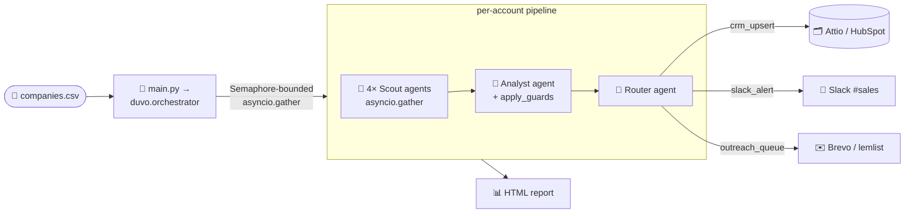

<div align="center">

# 🛰️ duvo-signal-loop

**A team of tool-using AI agents that turns a target list of retail/CPG accounts into rep-ready pipeline** — scouting intent signals, scoring ICP fit, and routing accounts into your sales stack.

[](https://www.python.org/)
[](https://docs.python.org/3/library/asyncio.html)
[](https://www.python-httpx.org/)
[](https://www.anthropic.com/)
[](#-tests)
[](#-tests)

</div>

---

## ✨ Highlights

- 🤖 **Multi-agent by design** — scouts → analyst → router, each a real tool-using agent on one shared loop.
- ⚡ **Async-first & production-ready** — `asyncio` end-to-end, pooled `httpx` client, bounded concurrency, timeouts at every layer.
- 🔌 **Pluggable stack** — swap LLM (Anthropic ⇄ OpenAI ⇄ local), CRM (Attio ⇄ HubSpot), and outreach (Brevo ⇄ lemlist) with a single env var.
- 🛡️ **Bounded agency** — deterministic guards, score clamping, and a router that **never sends** without a human in the loop.
- 🧪 **Fully tested offline** — 355 mocked tests, no API keys or network required.
- 📊 **Self-documenting runs** — every run renders an HTML audit report of decisions and agent tool calls.

---

## 🗺️ Architecture



Every agent runs on one shared async tool-use loop (`duvo.agent_core.run_agent`) backed by a **pluggable LLM provider** (LiteLLM by default — Anthropic, OpenAI, or a local model, selected via `LLM_MODEL`); only `duvo/llm/litellm_provider.py` touches the wire format. Write-backs (`crm`, `slack`, `outreach`) share a single **`httpx.AsyncClient`** via `duvo.infra.http_client.get_client()` — one connection pool for the whole process. `duvo.orchestrator` only orchestrates the hand-offs (reached through the thin `main.py` entry shim).

---

## 🤝 The agents

| Agent | Role |
|---|---|
| 🔎 **Scout** (×4, concurrent) | Each owns a beat (ERP · hiring · M&A · pain), uses an `exa_search` tool, decides its own queries, and returns **only sourced signals**. The four fan out via `asyncio.gather`; one failing beat is isolated so the others still produce signals. `exa_search` uses Exa's native async client (`AsyncExa`), so it awaits directly on the event loop. |
| 🧠 **Analyst** | Validates signals (can run its own verification searches before trusting a claim), scores ICP fit, and drafts personalized outreach. A deterministic `apply_guards()` caps any hallucinated confidence, and the score is clamped to the valid **1–10** range before it is trusted. |
| 🚦 **Router** | Decides how to action the account — its tools *are* the write-backs. They self-guard: Slack/outreach refuse anything but a confident Tier 1, and the guard fires **before** the write-back module is even imported. |

---

## 🔌 Pluggable LLM

All agents share one async tool-use loop (`duvo.agent_core.run_agent`). The model backend is swapped via two env vars — no code changes needed. `duvo/llm/` owns all provider concerns; only `duvo/llm/litellm_provider.py` may import `litellm`.

| `LLM_MODEL` | Extra var needed | Notes |
|---|---|---|
| `anthropic/claude-sonnet-4-6` | *(none — uses `ANTHROPIC_API_KEY`)* | Default; preserves original behavior |
| `openai/gpt-4o` | `OPENAI_API_KEY=sk-…` | OpenAI cloud |
| `openai/<served-model>` | `LLM_BASE_URL=http://host:8000/v1` | vLLM or any OpenAI-compatible server |
| `ollama_chat/llama3.1` | `LLM_BASE_URL=http://localhost:11434` | Local Ollama |

Set `LLM_PROVIDER=litellm` (default) to use the LiteLLM routing layer. `LLM_MAX_RETRIES` (default `2`) controls per-call model retries; `HTTP_MAX_RETRIES` (default `3`) caps write-back HTTP retries.

The LLM, CRM, and outreach seams all follow the same registry + Protocol pattern — Slack/notifications are the next natural drop-in extension point.

---

## 🔌 Pluggable CRM + outreach

One interface, two adapters each — point at Duvo's real stack by flipping a single env var, no other change. An unknown provider value logs a warning and falls back to the default.

| Step | Default 🟢 | Alternative | Switch |
|---|---|---|---|
| `crm.upsert_account()` | **Attio** — instant self-serve free API | **HubSpot** | `CRM_PROVIDER=hubspot` |
| `outreach.queue_lead()` | **Brevo** — free API, no card | **lemlist** | `OUTREACH_PROVIDER=lemlist` |

---

## 🚀 Setup

This project uses **[uv](https://docs.astral.sh/uv/)** — a fast, modern Python package manager.

```bash
# 1. install uv (if not already installed)
curl -LsSf https://astral.sh/uv/install.sh | sh

# 2. sync the environment (creates .venv + installs all dependencies)
uv sync

# 3. configure secrets
cp .env.example .env
```

Fill `.env` with **Exa**, **Anthropic**, `ATTIO_API_KEY` (keep `CRM_PROVIDER=attio`), the **Slack** webhook, and `BREVO_API_KEY` + `BREVO_LIST_ID` (keep `OUTREACH_PROVIDER=brevo`). See `.env.example` for exact, sourced steps.

### 🛠️ Adding or updating dependencies

```bash
# Add a production dependency
uv add 'package-name>=1.0'

# Add a development dependency
uv add --dev 'pytest-plugin'

# Update lockfile (commits to uv.lock)
uv lock

# Sync after dependency changes
uv sync
```

### ⚙️ Optional env knobs

All have sane defaults:

| Variable | Default | Purpose |
|---|---|---|
| `MAX_CONCURRENT_ACCOUNTS` | `5` | Account-level concurrency cap (semaphore bound) |
| `HTTP_TIMEOUT_SECONDS` | `30` | Per write-back HTTP request timeout |
| `ANTHROPIC_TIMEOUT_SECONDS` | `120` | Per LLM model-call timeout (passed to LiteLLM) |
| `ACCOUNT_TIMEOUT_SECONDS` | `300` | Wall-clock timeout per account (stops one hung account stalling the batch) |
| `LOG_LEVEL` | `INFO` | Logging verbosity |
| `LANGFUSE_ENABLED` | `false` | Turn on Langfuse tracing (needs `LANGFUSE_PUBLIC_KEY` + `LANGFUSE_SECRET_KEY`); OFF keeps `--dry-run` and the offline tests key/network-free |
| `LANGFUSE_HOST` | `https://cloud.langfuse.com` | Langfuse ingestion endpoint |
| `APP_ENV` | `dev` | Environment label applied to traces + run tags |

---

## ▶️ Run

Run with `uv run` (dependencies are automatically in scope) or after activating `.venv/bin/activate`:

| Command | What it does |
|---|---|
| `uv run python main.py --dry-run` | Agents run and **really decide**; write-back tools simulate (safe demo fallback) |
| `uv run python main.py --limit 3` | First 3 accounts only (fast live demo) |
| `uv run python main.py` | Full concurrent loop with write-backs → run-scoped report under `output/run_reports/` |
| `uv run python main.py --concurrency 3` | Override `MAX_CONCURRENT_ACCOUNTS` for this run |
| `uv run python main.py --test-email you@example.com` | Use your own inbox for the queued outreach lead (overrides `TEST_EMAIL`) |
| `uv run python main.py --log-level DEBUG` | Verbose logs (every turn, tool call, and guard decision) |

> ⚠️ **Note:** even `--dry-run` makes **real** Exa + LLM calls (only the write-backs are simulated), so it needs a valid `EXA_API_KEY` plus the key for your `LLM_MODEL` (`ANTHROPIC_API_KEY` by default).

---

## ⚡ Async architecture

The entire pipeline is async end-to-end:

- 🎯 **Orchestrator** (`duvo.orchestrator`, reached via the `main.py` entry shim) — `async def run(...)` fans out all accounts concurrently via `asyncio.gather`, bounded by `asyncio.Semaphore(MAX_CONCURRENT_ACCOUNTS)`. Each account runs in its own `_process_account` coroutine, so a single failure logs an error and yields `None` without aborting the batch. The shared `httpx.AsyncClient` is always closed via `await http_client.aclose()` in a `finally` block — even if every account fails.
- 🔎 **Scouts** — four beats fan out via `asyncio.gather` inside `scout_all`; `exa_search` awaits Exa's native `AsyncExa` client directly on the loop.
- 🧠🚦 **Analyst / Router** — `async def run_analyst` / `async def run_router` each drive the shared `async run_agent` loop; write-backs are awaited async `httpx` calls.
- 📊 **Reporter** — `generate_report(results)` stays **sync** (pure CPU + file I/O, no network); calling it from an async context is safe and correct.
- 🏁 **Entry point** — `asyncio.run(run(...))`.

---

## 🧾 Logging

Every module logs through a single `duvo.*` logger tree configured by `duvo.infra.logging_setup.configure_logging()` (called at startup; level set by `--log-level` / `LOG_LEVEL`). You get a timestamped, levelled trace of each agent turn, every tool call, every guard decision, and every write-back result — enough to debug a run from the console alone. **Secrets** (API keys, the Slack webhook URL) are never logged.

---

## 🔭 Tracing (optional)

Set `LANGFUSE_ENABLED=true` (plus `LANGFUSE_PUBLIC_KEY` / `LANGFUSE_SECRET_KEY`) to emit one [Langfuse](https://langfuse.com/) trace **per run** — the batch span wraps every account-run, and each agent turn, tool call, and guard decision nests underneath as a typed span. Tracing is **OFF by default** and lives behind a single lazy boundary: only `duvo/infra/tracing.py` imports `langfuse`, so `--dry-run` and the offline test suite never import it or touch the network. The HTML report header carries the `batch_run_id` so a report links back to its trace.

---

## 🧪 Tests

Built test-first and runs **fully offline** — every external dependency (the LLM provider via `litellm.acompletion`, Exa, and all HTTP write-backs) is mocked, so the suite needs no API keys and makes no network calls.

```bash
# Run tests with uv
uv run pytest -q          # 355 tests, ~1s

# Or activate the venv first, then run pytest directly
source .venv/bin/activate && pytest -q
```

Coverage includes:

- ✅ the model contract (enforced via Pydantic `Literal`/range constraints)
- ✅ the async tool-use loop (incl. unknown-tool and tool-error paths)
- ✅ scout parallelism + per-beat isolation
- ✅ analyst score-clamping and the deterministic guards
- ✅ the router's never-send safety guard — proven to fire *before* the lazy import
- ✅ every CRM/Slack/outreach adapter's request shaping and error handling
- ✅ the orchestrator (concurrent gather, semaphore, per-account isolation, `http_client.aclose` in `finally`, `--concurrency` flag)
- ✅ HTML report rendering

---

## 🛡️ Where agency is bounded (deliberate human-in-the-loop)

- 🚫 Scouts may not invent; the analyst independently verifies; undated signals are discarded.
- 🎚️ `apply_guards()` — **not the model** — caps low-confidence high scores and flags thin accounts; the score is clamped to 1–10 so a hallucinated number can never crash or skew a run.
- 📮 The router **never sends**: outreach leads land in a **review list** (Brevo) / **paused** campaign (lemlist) a rep approves; Slack/outreach tools refuse non-confident-Tier-1 accounts even if the agent asks — and the guard short-circuits before the send module loads.

---

## 🧩 Where it breaks (honest limits)

- 🌫️ Exa noise/staleness on big brands (scout iteration + analyst verification mitigate; recall limited).
- ⏱️ Agent loops add latency/variance; bounded by turn caps. Demo runs a few accounts live, full list pre-run.
- 📧 No real person-level email — persona recommended; demo uses a test email as the lead.
- 🔁 One-shot run; production = scheduled run + score diff + alert only on change. No CRM dedup yet (re-runs create new records; production would assert/upsert).

---

## 🏭 Production notes

- **Bounded concurrency** — `asyncio.Semaphore(MAX_CONCURRENT_ACCOUNTS)` prevents thundering-herd against the LLM/Exa rate limits; tune via env var or `--concurrency`.
- **Pooled async HTTP client** — one `httpx.AsyncClient` with `HTTP_TIMEOUT_SECONDS` timeout shared across all write-backs; gracefully closed in the orchestrator `finally`.
- **Per-account isolation** — a failed account (network error, model/account timeout, bad JSON) is logged and excluded from the report; it never cancels other accounts or raises out of `run()`.
- **Transient-failure retries** — write-back HTTP calls retry on 408/425/429/5xx with capped exponential backoff + jitter (`HTTP_MAX_RETRIES`); LLM calls retry via LiteLLM's `num_retries` (`LLM_MAX_RETRIES`).
- **Next steps** — structured CRM dedup (upsert on domain) · score-diff alerting on re-runs · durable run-state for resumability.

---

## 🛣️ Roadmap (what I'd build next, ~1 week)

Scouts as MCP-tool agents (Apollo / LinkedIn / Gong) · a discovery agent for net-new accounts · a Gong call-outcome agent writing back to the CRM · a reply-handling agent branching the outreach sequence on intent · promoting the ICP score to a structured CRM attribute. **The `run_agent` async runtime stays; only toolsets grow.**

---

## 📂 Project layout

```text
duvo-signal-loop/
├── duvo/                       # application package (mirrors the duvo.* logger tree)
│   ├── config.py               # env + model/provider + constants (concurrency + HTTP/model/account timeouts)
│   ├── models.py               # Pydantic contract shared across agents
│   ├── agent_core.py           # async run_agent() tool-use loop (provider-neutral)
│   ├── llm/                     # LLM seam: neutral types + registry + LiteLLM provider
│   ├── orchestrator.py         # async orchestrator: semaphore-bounded gather → report
│   ├── infra/                  # cross-cutting infrastructure
│   │   ├── logging_setup.py    # central duvo.* logger
│   │   ├── http_client.py      # shared pooled httpx.AsyncClient — get_client() + async aclose()
│   │   ├── retry.py            # with_retries() — transient-failure retry w/ backoff for write-backs
│   │   └── tracing.py          # lazy Langfuse boundary — span()/trace_context(); OFF unless LANGFUSE_ENABLED
│   ├── shared_agentic_tools/
│   │   └── exa_tool.py         # shared exa_search tool (native AsyncExa client)
│   ├── agents/
│   │   ├── prompt_loader.py     # shared helper for reading agent-owned Markdown prompts
│   │   ├── scouts/             # runner, beats, isolation, prompts/, scout-specific tools
│   │   ├── analyst/            # runner, deterministic guards, prompts/, analyst-specific tools
│   │   └── router/             # runner, policy helpers, prompts/, self-guarding router tools
│   ├── writeback/
│   │   ├── base.py / registry.py   # CRM/Outreach Protocols + @register_crm/@register_outreach registry
│   │   ├── crm.py              # async CRM dispatcher → registry (attio | hubspot)
│   │   ├── attio.py / hubspot.py   # @register_crm adapters (with_retries on every POST)
│   │   ├── slack.py            # async Tier-1 #sales alert
│   │   ├── outreach.py         # async outreach dispatcher → registry (brevo | lemlist)
│   │   └── brevo.py / lemlist.py   # @register_outreach adapters
│   └── reporting/
│       ├── reporter.py         # sync HTML audit report (pure CPU/file — no async needed)
│       └── templates/report.html
├── main.py                     # thin entry shim → duvo.orchestrator:main (keeps `python main.py` working)
├── companies.csv               # input target list
├── pyproject.toml              # deps + pytest + ruff config (uv-managed; lockfile in uv.lock)
├── tests/                      # pytest suite (fully mocked, no keys/network, asyncio_mode=auto)
└── output/                     # generated reports (gitignored)
```

> Each folder groups one functional concern: the package root holds the shared kernel (`config`, `models`, `agent_core`) and the `orchestrator`; `infra/` cross-cutting infrastructure; `shared_agentic_tools/` cross-agent tools; `agents/` the scout, analyst, and router packages (with agent-specific prompts and tools inside each package); `writeback/` the pluggable sales-stack adapters; `reporting/` the HTML audit report.

<div align="center">
<sub>Built with Claude · async-first · human-in-the-loop by design</sub>
</div>
